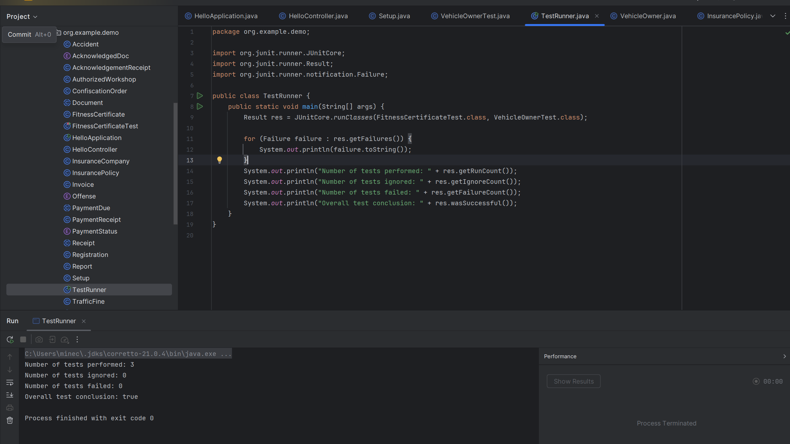

# Functional Testing
- JUNIT 5 was used to perform functional tests for the app's development to ensure that data was being handled in the way that was intended.
- A test was developed to ensure that the intended ID for fitness certificates was being issued to the vechiles.
- Furthermore, a test was developed to ensure that the counter for the ID assigning for these certificates was behaving as expected.
- Lastly, a test ensuring that the user provides a valid input for the QID for the vehicle owner was also developed. This test makes it so that the input string does not contain letters, only numbers (as intended).

Below is a screenshot that shows the test running and the results:

