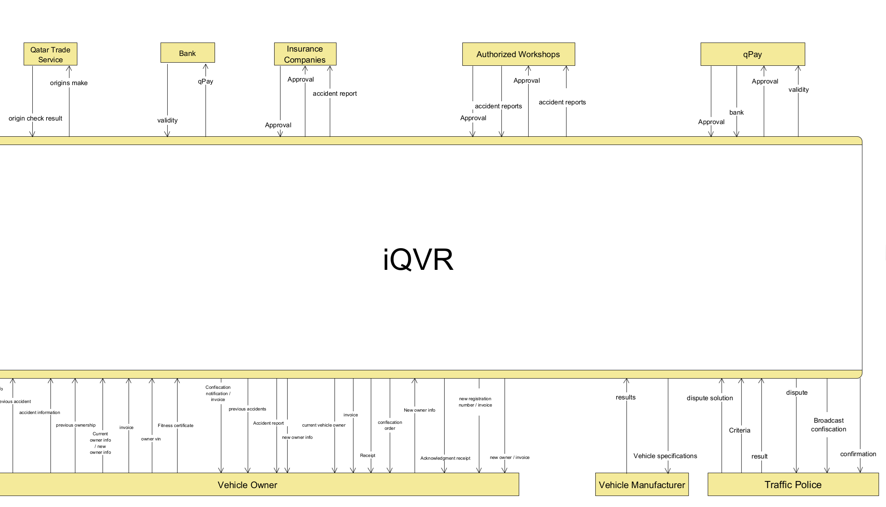
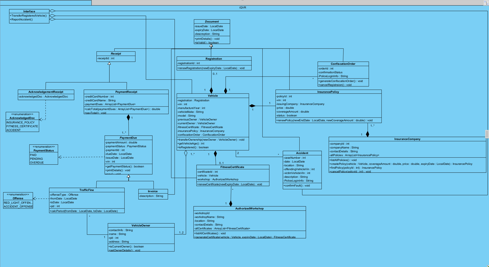
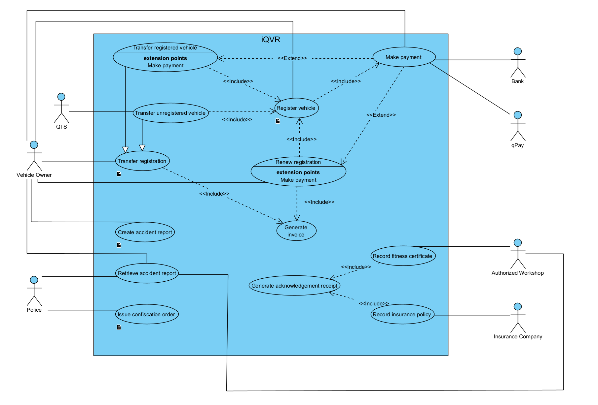

# Introduction
- **Project Name:** iQVR Vehicle Services Platform
- **Course:** CMPS 310 Software Engineering Lab
- **Instructor:** Georges Younes
- **Team Members:**
	- Mahmoud Al-Qudeimat - 202204636
	- Mohammad Ahmad - 202002453
	- Obada Alrefai - 202110207
	- Yahya Taha - 202103476

---

# Project Overview
- An online platform offering:
  - Vehicle registration renewal
  - Ownership transfer
  - Insurance policy management
  - Fitness certificate management
  - Accident reporting
  - Penalty handling
- Focused on providing a secure, efficient system for vehicle-related services.

---

# Design Decisions
- **Architecture:**  
  Implemented a structured class design as per the class diagram.
  - Used ECB (Entity-Control-Boundary) for designing sequence diagrams.
- **Key Consideration:**  
  Data confidentiality by isolating core vehicle and ownership data from general user access.

---

# Diagrams
- ## **DFD**
  - ### _Level 0_
   

---

- ## Class Diagram 
 

---

- ## Use Case Diagram 
 

---

# Technology Stack
- **Programming Language:** Java
- **UI Framework:** JavaFX
- **Documentation Tools:** Markdown, Obsidian
- **Diagram Modeling:** Visual Paradigm, draw.io, GanttProject
- **Presentation Generation:** Markdown and Pandoc

---

# Core Functionalities
- **Finance Section:** Handles payments.
- **Penalty Section:** Manages fines and offenses.
- **Registration Section:** Processes renewals and ownership transfers.
- **Accident Section:** Handles accident-related matters.
- **Technical Section:** Manages vehicle fitness certificates.

---

# Code Structure
- **Main Classes:**
  - `Accident.java`
  - `InsurancePolicy.java`
  - `Vehicle.java`
  - `Registration.java`
  - `TrafficFine.java`
  - `Invoice.java`
  - `FitnessCertificate.java`
  - And others...
- **Organized Modules:** Each class corresponds to specific system functions, ensuring modularity and maintainability.

---

# Data Management
- Data flow illustrated in:
  - **Class Diagram:** Defines the relationships and structure.
  - **Sequence Diagram:** Demonstrates the registration renewal and confiscation order processes.
  - **DFD (Level 1):** Shows data interactions across modules.
- Secure handling of vehicle and ownership data through access control.

---

# Technical Achievements
- Successfully implemented a comprehensive class and sequence diagram that ensured clear system interactions.
- Ensured secure handling of vehicle and ownership data by implementing access control mechanisms.
  
---

# Challenges Faced
- **Module Integration:**  
  Integrating various modules like finance, penalty, and accident management was complex and required regular reviews.
- **Scheduling Conflicts:**  
  Managing time and coordinating efforts across team members with different schedules.

---

# Lessons Learned
- **Effective Communication:**  
  Clear communication among team members was crucial.
- **Early Planning:**  
  Early and detailed planning helped avoid last-minute challenges.
- **Documentation:**  
  Maintaining thorough documentation ensured smooth progress.
- **Time Management:**  
  Learned to balance time effectively for different project phases.
- **Utilizing Tools:**  
  Leveraged tools like Visual Paradigm and GanttProject to streamline development.

---

# Future Improvements
- **Enhanced User Authentication:**  
  Implement multi-factor authentication for better security.
- **Mobile App Development:**  
  Develop a mobile version to increase accessibility.
- **Reporting Dashboard:**  
  Introduce analytics and reporting features for vehicle management insights.

---

# Conclusion
- **Project Impact:**  
  Developed a comprehensive platform for vehicle services, ensuring efficiency and security.
- **Future Prospects:**  
  Expand functionality and enhance user experience based on feedback and further development.

---

# Thank you!
